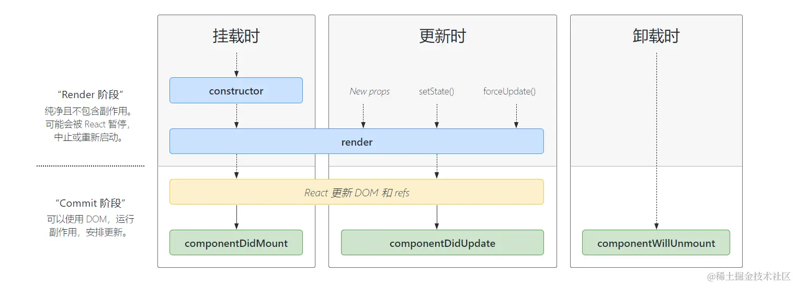
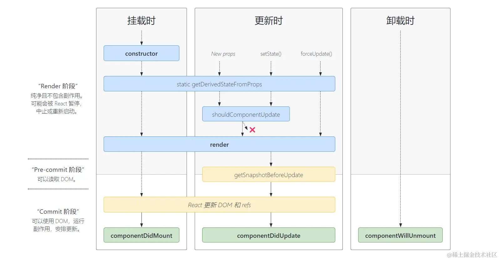

# 不全局安装 create-react-app ,生成一个 react 项目

```
npx create-react-app learn-react
```

# react 的生命周期

-   之前

        > 挂载时时执行顺序

        -   render 阶段
            constructor 》
            componentWillMount(将要挂载时调用，会执行一次或多次)【该钩子函数重命名为 UNSAFE_componentWillMount，不推荐使用，旧的名称在 18 之后不再支持】》
            render(渲染) 》
        -   Commit 阶段【可以使用 DOM】
            componentDidMount(挂载后调用) 【适合异步请求】》

        > 卸载时时执行顺序
         componentWillUnmount（卸载或销毁前调用） 》

    

-   之后

    

# react 的常用语法

> 减少 ref 的使用

## ref 字符串形式【不推荐使用,用法同 vue 一样】

```
<label >用户名：<input  ref="usernameRef"  type="text"/></label>
console.log(this.refs.usernameRef)

```

## ref 的回调用法【推荐】

```
<label >密码：<input ref={(ref)=>{this.pwdRef=ref}} type="password" /></label>
```

## createRef 的用法【最推荐】

```
import React from "react";
class Login extends React.Component{
    constructor(props){
        super(props)
        this.state = {
            name:'',
            pwd:""
        }
    }
    nameRef=React.createRef()// createRef的用法【最推荐用法】
    pwdRef = null//ref的回调用法
    render(){
        return <>
        <List />
        <label >用户名：<input  ref={this.nameRef}  type="text"/></label>
        <label >密码：<input ref={(ref)=>{this.pwdRef=ref}} type="password" /></label>
        <button onClick={this.loginDeal}>登录</button>
        <p>当前登录信息为:用户名：{this.state.name} 密码：{this.state.pwd}</p>
        </>
    }
    loginDeal=()=>{
        console.log(this.nameRef)
        this.setState({
            pwd:this.pwdRef.value,
            name:this.nameRef.current.value
        })
    }
}
export default Login
```
