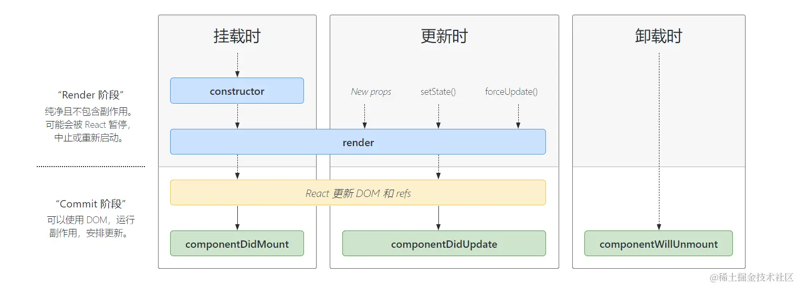
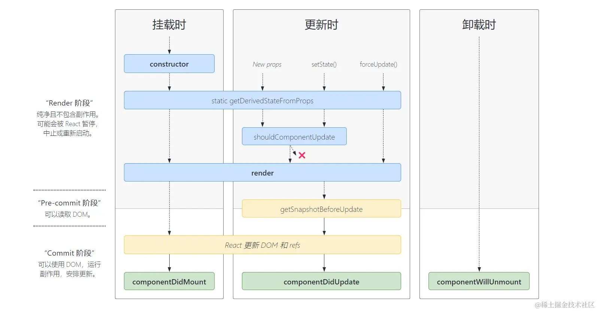
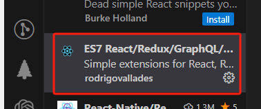

# react

    > 安装项目

# 不全局安装 create-react-app ,生成一个 react 项目

```
npx create-react-app learn-react
```

## react 的生命周期

-   之前

        > 挂载时时执行顺序

        -   render 阶段
            constructor 》
            componentWillMount(将要挂载时调用，会执行一次或多次)【该钩子函数重命名为 UNSAFE_componentWillMount，不推荐使用，旧的名称在 18 之后不再支持】》
            render(渲染) 》
        -   Commit 阶段【可以使用 DOM】
            componentDidMount(挂载后调用) 【适合异步请求数据、定时器、开始订阅】》

        > 卸载时时执行顺序
         componentWillUnmount（卸载或销毁前调用）【关闭定时器、取消订阅】 》

    

-   之后

    

# react 的常用语法

> 减少 ref 的使用

## ref 字符串形式【不推荐使用,用法同 vue 一样】

```
<label >用户名：<input  ref="usernameRef"  type="text"/></label>
console.log(this.refs.usernameRef)

```

## ref 的回调用法【推荐】

```
<label >密码：<input ref={(ref)=>{this.pwdRef=ref}} type="password" /></label>
```

## createRef 的用法【最推荐】

```
import React from "react";
class Login extends React.Component{
    constructor(props){
        super(props)
        this.state = {
            name:'',
            pwd:""
        }
    }
    nameRef=React.createRef()// createRef的用法【最推荐用法】
    pwdRef = null//ref的回调用法
    render(){
        return <>
        <List />
        <label >用户名：<input  ref={this.nameRef}  type="text"/></label>
        <label >密码：<input ref={(ref)=>{this.pwdRef=ref}} type="password" /></label>
        <button onClick={this.loginDeal}>登录</button>
        <p>当前登录信息为:用户名：{this.state.name} 密码：{this.state.pwd}</p>
        </>
    }
    loginDeal=()=>{
        console.log(this.nameRef)
        this.setState({
            pwd:this.pwdRef.value,
            name:this.nameRef.current.value
        })
    }
}
export default Login
```

> # antd 框架

-   安装 antd
    `npm install antd --save`
-   安装 antd 图标
    `npm install @ant-design/icons --save`

> # create-react-app 脚手架

## scss 使用

    ## 安装 sass

    `npm i sass`

## 添加别名路径@

### 安装 @craco/craco

```
npm i @craco/craco
```

### 根目录创建 craco.config.js

```
const path = require("path")

module.exports = {
  webpack: {
    // 配置路径别名
    alias: {
      "@": path.join(__dirname, "src"),
    },
  },
}

```

### 修改 package.json 的命令

```
"scripts": {
    "start": "craco start",
    "build": "craco build",
    "test": "craco test",
    "eject": "craco eject"
}
```

### 为了项目提示别名路径,不报错

#### 根目录创建 path.tsconfig.json

```
{
    "compilerOptions": {
        "baseUrl": "./",
        "paths": {
        "@/*": ["src/*"]
        }
    }
}
```

#### 建立 jsconfig.js

```
{
	"extends": "./path.tsconfig.json"
}
```

> # react-router 的常见用法

-   1. 添加 router 文件目录，添加 index.js 文件

```
import { createBrowserRouter } from "react-router-dom";
import Login from "./views/system/login/index"
import Layout from "./views/system/layout/index"
import Error  from "@/views/layout/error";
const router = createBrowserRouter([
    {
        path:"/",
        element:<Layout />,
        errorElement:<Error />
    },
    {
        path:"/login",
        element:<Login />,
        errorElement:<Error />
    }
])
export default router;
```

-   2. 在 src/index.js 目录使用

```
import React from 'react';
import ReactDOM from 'react-dom/client';
import { RouterProvider } from 'react-router-dom';
import router from "./router"

const root = ReactDOM.createRoot(document.getElementById('root'));

root.render(
  <React.StrictMode>
    <RouterProvider router={router} />
  </React.StrictMode>
);
```

## 安装

`npm install react-router-dom localforage match-sorter sort-by`

## 基本使用

```
import { createBrowserRouter } from "react-router-dom";
import Login from "./views/system/login/index"
import Layout from "./views/system/layout/index"
import Error  from "@/views/layout/error";
const router = createBrowserRouter([
    {
        path:"/",
        element:<Layout />,
        errorElement:<Error />
    },
    {
        path:"/login",
        element:<Login />,
        errorElement:<Error />
    }
])
export default router;
```

> # vscode 中 react 的常用插件


